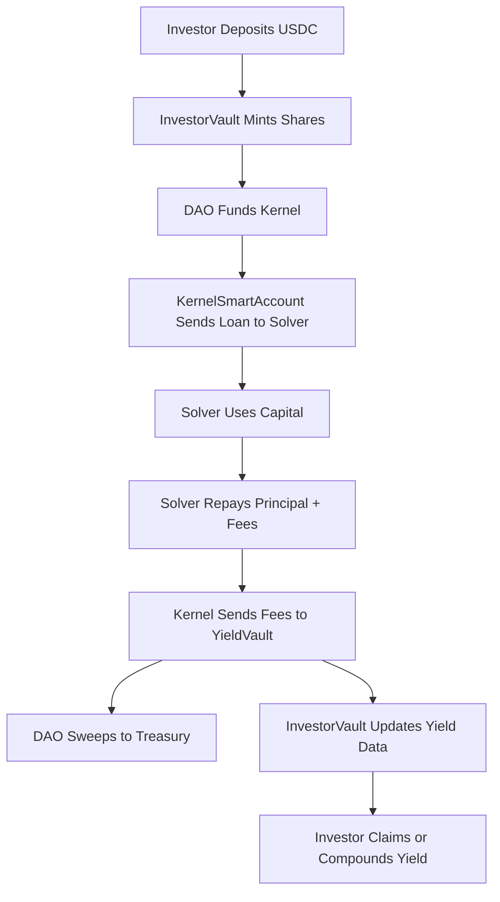

# 🧩 Service Kernel Framework

**The Service Kernel Framework** is a modular, DAO-controlled capital routing system built on **Arbitrum**. It connects USDC investors, decentralized capital deployment logic, and real-world service providers (“solvers”) to generate sustainable yield. This system powers **Service Coin’s Real-Yield Economy** and is fully operable through an on-chain, permissionless frontend.

---

## 🏗️ Overview

The framework uses three main contracts:

| Contract              | Role                          | Description |
|-----------------------|-------------------------------|-------------|
| `InvestorVault`       | Capital Pool                  | Accepts USDC from investors and mints shares. Manages yield claims. |
| `KernelSmartAccount`  | DAO Capital Brain             | Disburses loans, tracks repayments, forwards yield to vault. |
| `YieldVault`          | Profit Sink & Fee Router      | Holds yield generated by solvers. DAO can sweep to treasury. |

---

## 👥 Participants

- **Investor**: Deposits USDC into `InvestorVault`, earns yield, can withdraw.
- **Solver**: Whitelisted by DAO to borrow capital and repay with yield.
- **DAO Operator**: Manages vaults, whitelists solvers, configures performance fees, and routes funds.

---

## ⚙️ How the System Works

### 1. Investor Deposits

- USDC is deposited via the `InvestorVault`
- Shares are minted, representing investor ownership
- Investors earn claimable yield over time

### 2. DAO Deploys Capital

- DAO sends capital from the `InvestorVault` to the `Kernel`
- Kernel tracks total deployed capital and prepares for loan issuance

### 3. Solver is Whitelisted & Funded

- DAO whitelists a solver address using `setSolverAddress`
- DAO issues a loan using `disburseLoan(address, amount)`
- Kernel transfers capital to the solver

### 4. Solver Repays Loan

- Solver sends USDC back (principal + fees) to the Kernel address
- Solver calls `settleLoanFromBalance(principal, fee)`
- Kernel records repayment and forwards fees to `YieldVault`

### 5. DAO Sweeps Yield

- DAO uses `sweepFullBalanceToTreasury()` or `sweepToTreasury(amount)` from `YieldVault`
- Funds are moved to DAO treasury

### 6. Investor Claims or Compounds Yield

- Investors can claim yield or auto-compound it via frontend buttons:
  - `claimYield()`  
  - `compoundYield()`  
  - Or withdraw entire balance via `withdraw()`

---

## 🖥️ Frontend Features

The frontend dashboard includes:

- 🔗 Wallet connection (via MetaMask)
- 📊 Live USDC balances and claimable yield
- 💸 Deposit / Withdraw / Claim / Compound flows
- 🧠 DAO tools: whitelist solvers, deploy capital, set fees, sweep vaults
- 🤖 Solver tools: repay loans with UI support
- 📜 Real-time event log viewer
- 🧮 Full visibility into vault and kernel stats

---

## 🛠️ Admin (DAO) Capabilities

| Action | Description |
|--------|-------------|
| `setSolverAddress()` | Add/remove a solver |
| `disburseLoan()` | Issue USDC loan to solver |
| `deployCapitalFromVault()` | Move funds from `InvestorVault` to `Kernel` |
| `settleLoanFromBalance()` | Record loan repayment |
| `sweepToTreasury()` | Transfer yield from `YieldVault` to treasury |
| `setPerformanceFee()` | Configure DAO fee cut (in BPS) |
| `proposeNewVaults()` / `finalize*VaultChange()` | Hot swap core vaults after time delay |

---

## 🔁 System Flow Diagram

---

## ✅ Quick Commands (for developers)

- Deposit: `investorVault.deposit(amount)`
- Fund Kernel: `investorVault.fundKernel(amount)`
- Disburse Loan: `kernel.disburseLoan(address, amount)`
- Repay Loan: `kernel.settleLoanFromBalance(principal, fee)`
- Claim Yield: `investorVault.claimYield()`

---

## 🔐 Contract Addresses (Live on Arbitrum)

- **USDC Token**: `0xaf88...5831`
- **InvestorVault**: `0x1a51...aa90`
- **KernelSmartAccount**: `0x752e...7C3F`
- **YieldVault**: `0x44D6...432C`
